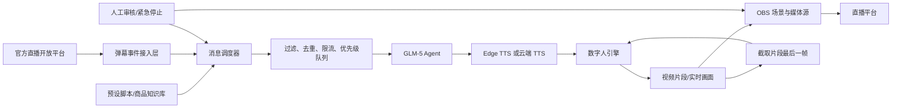
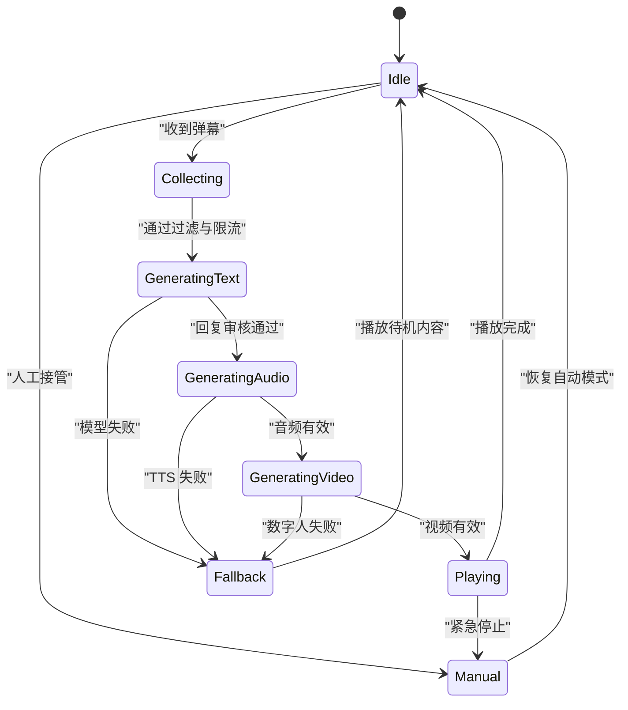

# 数字人 SDK、直播弹幕采集与 Agent 集成参考

> 本文面向当前 `gradio-demo` 项目，目标是把“文案生成 → 文本转语音 → 数字人视频 → OBS 推流 → 直播弹幕 → Agent 回复”串成一套完整方案。
>
> 当前开发设备：Apple M1、8GB 内存、macOS。该设备不支持 NVIDIA CUDA，因此本文会同时给出本地验证方案和云端生产方案。

## 1. 项目目标

系统接收预设主题或直播间弹幕，由大语言模型生成适合口播的回复，再将回复转换为语音并驱动数字人。生成的视频或实时画面交给 OBS，最后推送到直播平台。

核心能力包括：

1. 预设文案和商品知识库；
2. 直播间评论、点赞、礼物等事件接收；
3. 弹幕去重、限流、过滤和优先级排序；
4. Agent 根据上下文生成回复；
5. TTS 生成语音；
6. 数字人生成播报视频或实时画面；
7. OBS 场景切换与直播推流；
8. 日志、监控、人工接管和安全审核。

## 2. 整体架构



推荐将系统拆成六个独立模块：

```text
弹幕接入层 → 消息队列 → Agent → TTS → 数字人 → OBS
```

不要把所有逻辑都写在 Gradio 点击事件中。Gradio 适合做控制台和原型界面，长时间运行的直播任务应由后台服务和消息队列负责。

## 3. 数字人技术路线

### 3.1 三类方案

| 类型 | 输入 | 输出 | 优点 | 缺点 | 适用场景 |
|---|---|---|---|---|---|
| 单图音频驱动 | 人像图片 + 音频 | MP4 视频 | 接入简单，适合播报 | 通常不是实时生成 | 短视频、录播 |
| 驱动视频迁移 | 人像图片 + 驱动视频 | MP4 视频 | 表情和动作更自然 | 需要提前准备驱动视频 | 高质量视频制作 |
| 云端实时数字人 | 文本/音频 + 云端形象 | 实时流或视频 | 延迟低、稳定性高 | 需要购买服务和 API | 正式直播、客服 |

### 3.2 开源项目对比

#### SadTalker

- 仓库：[OpenTalker/SadTalker](https://github.com/OpenTalker/SadTalker)
- 输入：单张人像图片 + 音频；
- 输出：说话头像视频；
- 协议：仓库当前标注为 Apache-2.0，使用前仍应再次核对模型权重和第三方依赖协议；
- 优点：流程直接，适合作为当前 Gradio 项目的第一版数字人实现；
- 缺点：项目较老，效果和生成速度弱于新模型；长视频生成较慢；
- macOS：官方安装文档说明曾在 M1 Mac 上测试，但实际性能远低于 NVIDIA GPU。

示例调用：

```bash
python inference.py \
  --driven_audio input.wav \
  --source_image avatar.png \
  --result_dir results \
  --still \
  --preprocess full
```

对当前 M1 8GB 设备的建议：仅用于功能验证，先生成 5～15 秒片段，关闭 GFPGAN 等额外增强功能，避免同时运行多个模型。

#### LivePortrait

- 仓库：[KlingAIResearch/LivePortrait](https://github.com/KlingAIResearch/LivePortrait)
- 输入：源人像 + 驱动视频；
- 输出：动作和表情迁移后的视频；
- 优点：表情、姿态和画面稳定性通常优于早期单图说话模型；
- 限制：它本质上是视频驱动，而不是“音频直接驱动”；如需口型匹配，还要准备口播驱动视频或增加音频口型模块；
- macOS：官方明确支持 Apple Silicon 的 Humans 模式，但提示速度可能比 RTX 4090 慢约 20 倍，Animals 模式不支持 macOS。

Apple Silicon 官方运行方式：

```bash
pip install -r requirements_macOS.txt
PYTORCH_ENABLE_MPS_FALLBACK=1 python inference.py
```

对当前设备的建议：适合离线制作效果更好的短片，不适合依靠 M1 8GB 实时直播。

#### 其他可研究项目

| 项目 | 参考地址 | 定位 | 当前项目建议 |
|---|---|---|---|
| AniPortrait | [Zejun-Yang/AniPortrait](https://github.com/Zejun-Yang/AniPortrait) | 音频/视频驱动人像动画 | 研究用，先核对 CUDA 和显存要求 |
| MOFA-Video | [MyNiuuu/MOFA-Video](https://github.com/MyNiuuu/MOFA-Video) | 可控图像动画 | 模型较重，不建议在 M1 8GB 上作为主线 |
| EchoMimic | [antgroup/echomimic](https://github.com/antgroup/echomimic) | 音频驱动人像动画 | 更偏 NVIDIA GPU 离线生成 |
| MuseTalk | [TMElyralab/MuseTalk](https://github.com/TMElyralab/MuseTalk) | 实时高质量口型同步 | 生产效果好，但通常依赖 NVIDIA CUDA |
| Hallo3 | [fudan-generative-vision/hallo3](https://github.com/fudan-generative-vision/hallo3) | 高动态、高保真人像动画 | 算力要求高，不适合当前 Mac 本地运行 |
| Duix | [GuijiAI/duix.ai](https://github.com/GuijiAI/duix.ai) | 移动端/端侧数字人 | 适合研究端侧产品，不等同于现有 Python 推理接口 |

项目名称、协议、模型权重地址和硬件要求会变化，正式采用前应以各仓库最新 README 和 LICENSE 为准。

### 3.3 商业数字人平台

当目标是低延迟、稳定直播，而不是研究模型时，商业云服务通常更合适：

- [腾讯云智能数智人](https://cloud.tencent.cn/document/product/1240)：支持播报和实时交互类数字人；
- [阿里云虚拟数字人](https://www.aliyun.com/product/ai/avatar)；
- [讯飞虚拟数字人](https://www.xfyun.cn/solutions/virtual-live-solution)；
- [火山引擎虚拟数字人](https://www.volcengine.com/product/avatar)。

选型时重点确认：

1. 是否提供文本驱动、音频驱动或实时 WebSocket 接口；
2. 首帧延迟和并发限制；
3. 是否支持自定义形象和声音复刻；
4. 视频返回方式是文件、HTTP-FLV、RTMP、WebRTC 还是透明通道；
5. 计费单位、试用额度和内容审核要求；
6. 形象、声音和生成内容的商业使用授权。

## 4. 当前 M1 8GB 电脑的推荐方案

### 4.1 推荐结论

当前电脑没有 NVIDIA GPU，不能安装 CUDA。建议采用“本地控制 + 云端生成”的混合架构：

| 环节 | 推荐实现 |
|---|---|
| 控制台 | 当前 Gradio 项目 |
| 文案 Agent | 腾讯云 Coding Plan / GLM-5 |
| TTS | 原型用 Edge TTS；生产用有 SLA 的云端 TTS |
| 数字人原型 | SadTalker，本地短片离线生成 |
| 数字人生产 | 腾讯云、阿里云、讯飞或火山引擎数字人 API |
| 直播编排 | OBS Studio + obs-websocket 5.x |
| 弹幕接入 | 优先使用直播平台官方开放平台 |
| 后台队列 | 开发期 `asyncio.Queue`；生产期 Redis Streams |

### 4.2 不推荐的做法

- 不要尝试在 Apple M1 上安装 CUDA；
- 不要把为 NVIDIA 编译的 PyTorch wheel 强行安装到 macOS；
- 不要指望 M1 8GB 持续实时运行 EchoMimic、Hallo3 等重型模型；
- 不要在 Gradio 请求线程内同步生成几分钟视频；
- 不要直接把所有弹幕都交给大模型，否则会造成费用、延迟和内容安全问题；
- 不要将 API Key、OBS 密码或直播推流码写入 Git。

## 5. 直播弹幕采集

### 5.1 首选：官方开放平台

抖音官方提供直播互动/弹幕玩法接入能力，可向开发者后端推送评论、点赞和礼物等事件。正式项目应优先使用官方渠道：

- [抖音开放平台弹幕玩法接入指南](https://partner.open-douyin.com/docs/resource/zh-CN/interaction/develop/douyincloud/guide)
- [抖音直播间评论互动能力](https://partner.open-douyin.com/docs/resource/zh-CN/interaction/jierushuoming/hudongshuju/pinglunshuju)
- [哔哩哔哩直播开放平台](https://openhome.bilibili.com/doc)

典型接入过程：

1. 注册开发者并创建应用；
2. 申请直播互动相关权限；
3. 主播授权并启动任务；
4. 平台通过 WebSocket 或服务端回调推送事件；
5. 后端验签、去重并发送确认；
6. 将标准化后的事件放入内部消息队列；
7. 直播结束时停止任务并清理连接。

### 5.2 第三方学习项目

截图中提到的项目可以用于理解协议和快速验证：

- Python：[saermart/DouyinLiveWebFetcher](https://github.com/saermart/DouyinLiveWebFetcher)
- Go：[jwwsjlm/douyinLive](https://github.com/jwwsjlm/douyinLive)

这类项目通常依赖网页端未公开协议、签名参数或逆向实现，可能随平台升级失效，也可能违反平台服务条款。建议只在以下条件下使用：

- 仅连接自己有权管理或已获得主播授权的直播间；
- 仅用于开发测试，不绕过登录、权限、风控或付费限制；
- 不批量采集、出售或建立用户画像；
- 不长期保存不必要的用户名、头像、用户 ID 和原始评论；
- 上线前切换到官方开放平台。

### 5.3 内部事件标准化

无论上游来自哪个平台，都应先转换为统一结构：

```json
{
  "event_id": "platform-event-id",
  "platform": "douyin",
  "room_id": "room-id",
  "event_type": "comment",
  "user": {
    "id_hash": "sha256-user-id",
    "nickname": "观众昵称"
  },
  "content": "这个产品多少钱？",
  "gift": null,
  "received_at": "2026-07-21T12:00:00+08:00",
  "raw": null
}
```

建议默认不保存上游完整 `raw` 数据。调试环境确需保存时，应进行脱敏并设置自动删除期限。

### 5.4 消息处理策略

收到事件后不要立即调用模型，应先经过以下步骤：

```text
验签 → 去重 → 内容审核 → 意图分类 → 限流 → 优先级排序 → Agent → 回复审核
```

推荐优先级：

1. 管理员或主播指令；
2. 明确的商品问题；
3. 高频重复问题的聚合结果；
4. 礼物感谢；
5. 普通互动；
6. 无意义字符、广告和攻击性内容直接丢弃。

示例限流规则：

- 同一用户 10 秒内最多进入队列一次；
- 相同问题 30 秒内合并；
- Agent 同时只生成一条回复；
- 回复音频累计排队超过 30 秒时，丢弃低优先级消息；
- 单条口播控制在 5～12 秒；
- 敏感问题转人工处理。

## 6. Agent 设计

### 6.1 Agent 输入

```json
{
  "role": "直播助理",
  "product_context": "商品名称、价格、库存、售后规则",
  "recent_dialogue": [],
  "viewer_message": "这个适合儿童吗？",
  "response_constraints": {
    "max_chars": 80,
    "style": "自然、热情、避免夸大宣传"
  }
}
```

### 6.2 提示词原则

- 只回答知识库确认过的信息；
- 不编造价格、库存、功效或售后政策；
- 不输出 Markdown、链接和舞台说明；
- 回复尽量控制在 80 个汉字以内；
- 对医疗、金融、未成年人等高风险内容拒绝自动回答；
- 无法确认时提示由人工主播补充；
- 将用户昵称与正文分开处理，避免提示词注入。

### 6.3 防止弹幕提示词注入

弹幕属于不可信输入。不要把弹幕直接拼接到系统提示词中，也不要允许弹幕修改模型角色、读取环境变量或触发任意工具。

```python
messages = [
    {"role": "system", "content": SYSTEM_PROMPT},
    {
        "role": "user",
        "content": {
            "viewer_message": sanitized_comment,
            "product_context": approved_product_context,
        },
    },
]
```

## 7. 文本转语音

当前项目使用 `edge-tts` 生成 MP3，优点是不需要 API Key，适合原型开发。缺点是它依赖外部在线服务，不提供企业级 SLA，不应视为完全离线组件。

当前配置示例：

```env
EDGE_TTS_VOICE=zh-CN-XiaoxiaoNeural
EDGE_TTS_RATE=+0%
```

生产环境应考虑：

- 腾讯云、阿里云、讯飞或火山引擎正式 TTS；
- 并发、超时、失败重试和缓存；
- 文本分句与长文本切片；
- 音色授权和声音复刻授权；
- 输出统一为数字人 SDK 需要的采样率和编码格式。

建议内部统一保存一份 WAV：

```text
PCM、单声道、16 bit、16 kHz 或数字人 SDK 指定采样率
```

展示和下载时可以额外生成 MP3。

## 8. 视频片段连续生成

如果数字人引擎一次只能生成一个片段，可使用以下策略降低跳变：

1. 每条回复生成 5～12 秒视频；
2. 保存片段最后一帧；
3. 如果模型支持，将最后一帧作为下一片段的源图；
4. 在片段头尾加入 100～300ms 静音或交叉淡化；
5. 使用 FFmpeg 统一分辨率、帧率、音频采样率；
6. 生成失败时播放待机视频，不让直播画面中断。

注意：把上一段最后一帧作为下一段输入并不能保证真正的时间一致性。长时间直播更适合支持流式驱动或固定数字人资产的商业 SDK。

## 9. OBS 集成

### 9.1 obs-websocket

[obsproject/obs-websocket](https://github.com/obsproject/obs-websocket) 从 OBS Studio 28 起已经默认内置。5.x 默认端口为 `4455`，应开启密码认证。

推荐场景：

```text
Scene-Idle       待机循环视频
Scene-Speaking   数字人口播媒体源
Scene-Fallback   故障提示或人工主播
Scene-Break      休息画面
```

Python 客户端可选择官方仓库列出的 `obsws-python` 或 `simpleobsws`。

示例配置：

```env
OBS_HOST=127.0.0.1
OBS_PORT=4455
OBS_PASSWORD=replace_me
```

### 9.2 播放片段流程

```text
数字人生成 MP4
  → 检查文件能否解码
  → 更新 OBS 媒体源文件路径
  → 重启媒体源播放
  → 切换到 Speaking 场景
  → 等待播放结束事件
  → 切回 Idle 场景
```

不要通过不停创建新媒体源来播放片段，优先复用固定媒体源并更新其设置。

### 9.3 推流注意事项

- 推流码只能保存在本机密钥配置或系统钥匙串中；
- OBS WebSocket 只监听本机或可信局域网；
- 开启密码且不要映射到公网；
- 设置断线自动重连；
- 使用硬件编码能力时优先选择 Apple VideoToolbox；
- M1 8GB 同时运行 OBS 和本地重型数字人模型容易发生内存压力。

## 10. 推荐运行状态机



## 11. 项目目录建议

```text
gradio-demo/
├── webui.py                    # Gradio 控制台
├── requirements.txt
├── .env.example
├── app/
│   ├── config.py               # 配置与密钥读取
│   ├── models.py               # 内部事件模型
│   ├── queue.py                # 优先级队列
│   ├── moderation.py           # 内容过滤与审核
│   ├── agent.py                # GLM-5 回复生成
│   ├── tts.py                  # TTS 抽象层
│   ├── avatar.py               # 数字人抽象层
│   ├── obs.py                  # OBS WebSocket 控制
│   └── orchestrator.py         # 状态机与任务编排
├── adapters/
│   ├── douyin_official.py      # 抖音官方开放平台
│   └── bilibili_official.py    # B站官方开放平台
├── assets/
│   ├── avatar.png
│   ├── idle.mp4
│   └── fallback.mp4
├── runtime/
│   ├── audio/
│   ├── video/
│   └── logs/
└── tests/
```

`runtime/`、`.env`、生成音视频、直播推流码和用户数据必须加入 `.gitignore`。

## 12. 分阶段落地计划

### 阶段一：离线演示

目标：输入主题后得到完整 MP4。

```text
主题 → GLM-5 → Edge TTS → SadTalker/云数字人 → MP4
```

验收标准：

- 文案生成失败时界面有明确错误；
- TTS 输出不是 0 秒音频；
- 上传合规人像后能生成可播放 MP4；
- 单任务串行执行，不发生内存溢出。

### 阶段二：OBS 播放

目标：自动在待机视频和口播视频之间切换。

- 安装 OBS Studio；
- 配置 `Idle` 和 `Speaking` 场景；
- 开启 obs-websocket 密码；
- Python 更新媒体源并监听播放结束事件；
- 验证异常时能够回到待机画面。

### 阶段三：官方弹幕接入

目标：将自己直播间的弹幕变成标准事件。

- 注册平台开发者应用；
- 申请官方直播互动权限；
- 实现验签、心跳、断线重连和事件去重；
- 先只记录经过脱敏的测试数据；
- 加入管理员开关和用户限流。

### 阶段四：自动回复闭环

目标：弹幕触发数字人口播。

- 建立商品知识库；
- 增加意图分类和敏感内容过滤；
- 只自动回答白名单意图；
- 高风险问题进入人工审核；
- 加入回复排队超时和待机兜底。

### 阶段五：生产化

目标：稳定直播而非演示。

- 将数字人改为云端实时 SDK；
- 使用 Redis Streams 或可靠消息队列；
- 增加监控、告警、审计和成本上限；
- 压测断线、积压、接口超时和 API 限流；
- 准备人工主播和静态视频的灾备方案。

## 13. 安全、隐私与平台合规

上线前至少完成以下检查：

- 获得数字人肖像、声音和素材的明确授权；
- 按平台要求标识 AI 生成或数字人内容；
- 使用官方接口或获得平台书面许可；
- 不采集与业务无关的个人信息；
- 用户 ID 脱敏，原始弹幕设置最短保存周期；
- 对弹幕和模型回复同时进行内容审核；
- 禁止模型生成虚假价格、疗效、收益承诺和违法内容；
- 提供人工接管、禁言、停止播报和一键切换场景能力；
- API Key、OBS 密码和推流码不进入日志和版本库；
- 遵守直播平台开发者协议、社区规范及适用的数据保护法规。

## 14. 最终选型建议

针对当前电脑和项目阶段，推荐顺序如下：

1. 保留现有 `Gradio + GLM-5 + Edge TTS`；
2. 先接 SadTalker 或数字人云 API，完成“音频 → MP4”；
3. 使用 OBS 28+ 内置的 obs-websocket 完成片段播放；
4. 弹幕只接自己直播间，优先申请抖音或 B 站官方开放平台；
5. 本地 M1 只做控制、预览和短片验证；
6. 正式实时直播改用云端数字人或 NVIDIA 云服务器；
7. 不把第三方逆向弹幕项目作为生产依赖。

这条路线对当前设备最现实，也能最大程度复用现有 Python 和 Gradio 代码。

## 15. 主要参考资料

- [SadTalker 官方仓库](https://github.com/OpenTalker/SadTalker)
- [SadTalker macOS 安装文档](https://github.com/OpenTalker/SadTalker/blob/main/docs/install.md)
- [LivePortrait 官方仓库](https://github.com/KlingAIResearch/LivePortrait)
- [OBS WebSocket 官方仓库](https://github.com/obsproject/obs-websocket)
- [抖音开放平台弹幕玩法接入指南](https://partner.open-douyin.com/docs/resource/zh-CN/interaction/develop/douyincloud/guide)
- [抖音直播间评论互动能力](https://partner.open-douyin.com/docs/resource/zh-CN/interaction/jierushuoming/hudongshuju/pinglunshuju)
- [哔哩哔哩直播开放平台](https://openhome.bilibili.com/doc)
- [腾讯云智能数智人](https://cloud.tencent.cn/document/product/1240)
- [DouyinLiveWebFetcher，仅作学习参考](https://github.com/saermart/DouyinLiveWebFetcher)
- [douyinLive，仅作学习参考](https://github.com/jwwsjlm/douyinLive)

---

文档整理日期：2026-07-21。第三方项目、平台接口、计费与协议可能发生变化，实施时应再次核对其最新官方文档。
