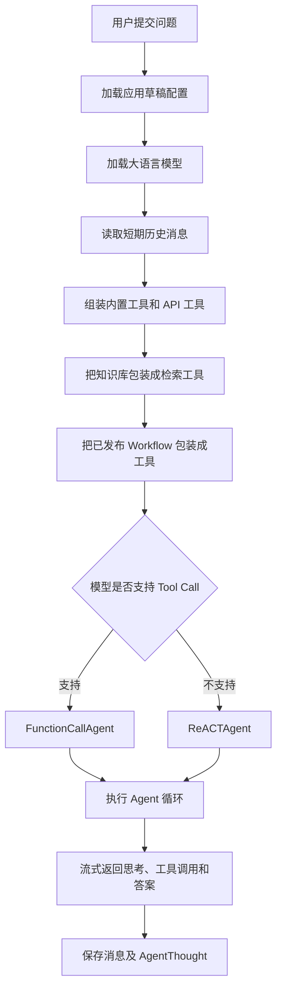

# LLMOps 大模型应用快速理解

> 使用场景：帮助第一次接触本项目的开发者，快速理解一个大模型应用是如何由模型、提示词、上下文、工具、知识库和工作流组装起来的。
>
> 快记：**Prompt 定规则，Context 给信息，Tools 给能力，Workflow 管步骤，Agent 做决策。**

## 1. 一句话认识这个项目中的大模型应用

这个项目中的“大模型应用”并不只是调用一次 LLM，而是围绕 LLM 组装以下内容：

- 模型：负责理解问题、推理、选择工具和生成回答。
- Prompt：规定模型的身份、目标、行为和限制。
- Context：向模型提供当前问题、历史消息和长期记忆。
- Tools：让模型能够检索知识库、调用 API 或执行其他能力。
- Workflow：把复杂、确定性的业务步骤封装成一个可调用的大工具。
- Agent：连接模型与工具，并控制“思考—调用—观察—回答”的循环。

因此，可以把项目的核心理解为：

```text
大模型应用 = LLM + Prompt + Context + Tools + Workflow + Agent 编排
```

## 2. 一次对话请求的完整链路

调试会话的主要入口是：

```text
internal/service/app_service.py -> AppService.debug_chat()
```

一次请求大致按照下面的顺序执行：



`debug_chat()` 中最关键的输入可以简化为：

```python
agent.stream({
    "messages": [current_user_message],
    "history": history,
    "long_term_memory": conversation.summary,
})
```

而 Agent 的配置中还包含：

```python
AgentConfig(
    preset_prompt=...,
    tools=tools,
    enable_long_term_memory=...,
    review_config=...,
)
```

## 3. 知识库为什么也是 Tool

相关代码入口：

```text
internal/service/app_service.py
internal/service/retrieval_service.py
```

应用关联知识库后，`debug_chat()` 不会直接把整个知识库传给模型，而是创建一个 LangChain 检索工具：

```python
dataset_retrieval = self.retrieval_service.create_langchain_tool_from_search(...)
tools.append(dataset_retrieval)
```

该工具接收一个查询字符串：

```python
@tool(DATASET_RETRIEVAL_TOOL_NAME, args_schema=DatasetRetrievalInput)
def dataset_retrieval(query: str) -> str:
    documents = self.search_in_datasets(...)
    return combine_documents(documents)
```

模型看到的是工具的名称、说明和参数结构，而不是知识库中的全部内容。当模型判断需要业务资料时，会发起工具调用：

```text
用户问题
  -> LLM 判断需要外部知识
  -> 调用 dataset_retrieval(query)
  -> 后端执行向量/全文/混合检索
  -> 检索结果返回给 LLM
  -> LLM 组织最终答案
```

这种方式属于 Agentic RAG：由 Agent 决定是否发起检索。

### 与传统 RAG 的区别

| 方式 | 执行流程 | 优点 | 注意点 |
| --- | --- | --- | --- |
| 传统 RAG | 用户问题 → 强制检索 → LLM | 行为稳定，适合必须基于资料回答的场景 | 简单问题也会产生检索成本 |
| Agentic RAG | 用户问题 → LLM 判断 → 按需检索 | 灵活，可以减少无意义检索 | 模型可能误判并跳过检索 |

如果业务要求“答案必须来自企业知识库”，只依赖模型自主决定可能不够稳定，可以考虑强制检索、路由判断或混合策略。

## 4. Workflow 为什么也是 Tool

相关代码入口：

```text
internal/service/app_config_service.py
internal/core/workflow/
```

已发布的 Workflow 会在 `get_langchain_tools_by_workflow_ids()` 中转换成 `WorkflowTool`：

```python
workflow_tool = WorkflowTool(
    workflow_config=WorkflowConfig(
        name=f"wf_{workflow_record.tool_call_name}",
        description=workflow_record.description,
        nodes=workflow_record.graph.get("nodes", []),
        edges=workflow_record.graph.get("edges", []),
    )
)
```

从上层 Agent 看，Workflow 只是一个可以调用的工具；但在工具内部，它可能执行一整套流程：

```text
开始节点
  -> 知识库检索节点
  -> HTTP/API 工具节点
  -> 代码节点
  -> LLM 节点
  -> 模板转换节点
  -> 结束节点
```

这种设计带来两层编排：

- Agent 层：决定是否调用某个 Workflow。
- Workflow 层：决定调用后严格执行哪些步骤。

快记：**Agent 负责动态决策，Workflow 负责稳定执行。**

## 5. History 不是 Tool

短期历史通过 `TokenBufferMemory` 从数据库消息中提取：

```python
history = token_buffer_memory.get_history_prompt_messages(
    message_limit=draft_app_config["dialog_round"],
)
```

它不会作为工具绑定给模型，而是直接成为模型的消息上下文。Agent 最终会把输入整理成类似下面的结构：

```text
System Message
  - Agent 系统规则
  - 应用预设 Prompt
  - 长期记忆摘要

History Messages
  - HumanMessage
  - AIMessage
  - HumanMessage
  - AIMessage

Current Message
  - 当前用户问题
```

History 与 Tool 的区别：

| 概念 | 解决的问题 | 进入模型的方式 |
| --- | --- | --- |
| History | 之前聊过什么 | 直接拼入消息上下文 |
| Long-term memory | 长期需要记住什么 | 以摘要形式加入 System Message |
| Tool | 模型能够做什么 | 以工具描述和参数 Schema 绑定给模型 |
| Knowledge retrieval | 去哪里查业务知识 | 在本项目中被包装成 Tool |
| Workflow | 复杂任务按照什么步骤执行 | 在本项目中被包装成 Tool |

## 6. FunctionCallAgent 与 ReACTAgent

项目会根据模型是否支持原生 Tool Call 选择不同的 Agent：

```python
agent_class = (
    FunctionCallAgent
    if ModelFeature.TOOL_CALL in llm.features
    else ReACTAgent
)
```

### FunctionCallAgent

支持原生工具调用的模型，通过 `bind_tools()` 接收工具：

```python
llm = llm.bind_tools(self.agent_config.tools)
```

模型以结构化数据返回工具名和参数，后端执行工具，再把结果交回模型。

### ReACTAgent

不支持原生 Tool Call 时，把工具名称、描述和参数写进系统提示词，让模型按照 ReAct 格式输出行动指令。

两者目标相同：

```text
LLM 思考
  -> 选择工具
  -> 执行工具
  -> 观察工具结果
  -> 继续思考或生成答案
```

主要区别是工具调用协议不同：一个依赖模型的原生结构化 Tool Call，一个依赖 Prompt 约定的文本格式。

## 7. 项目核心概念速查

| 模块 | 在项目中的作用 | 关键入口 |
| --- | --- | --- |
| AppService | 组装应用配置并启动对话 | `internal/service/app_service.py` |
| AppConfigService | 把应用配置转换成工具 | `internal/service/app_config_service.py` |
| RetrievalService | 搜索知识库并创建检索工具 | `internal/service/retrieval_service.py` |
| TokenBufferMemory | 按轮数和 Token 限制读取短期历史 | `internal/core/memory/` |
| FunctionCallAgent | 使用模型原生 Tool Call 编排工具 | `internal/core/agent/agents/function_call_agent.py` |
| ReACTAgent | 使用 ReAct Prompt 编排工具 | `internal/core/agent/agents/react_agent.py` |
| Workflow | 执行节点和边定义的固定流程 | `internal/core/workflow/` |
| ConversationService | 保存会话、答案和 Agent 推理事件 | `internal/service/conversation_service.py` |

## 8. 理解这个项目时最重要的结论

### 结论一：知识库没有直接传给模型

传给模型的是“知识库检索工具”的定义。真正的知识内容只有在工具被调用、检索完成后，才会进入本轮 Agent 上下文。

### 结论二：Workflow 是一个复合工具

Workflow 对上层 Agent 暴露一个工具接口，对内执行多个节点和固定业务步骤。

### 结论三：History 是上下文，不是工具

History 直接帮助模型理解多轮对话；Tool 则扩展模型可执行的能力。

### 结论四：大模型应用的核心不只是模型

模型负责推理和生成，但一个稳定的大模型应用还必须处理：

- 上下文怎么构建与裁剪；
- 工具如何描述、校验和执行；
- 哪些步骤允许模型自主判断；
- 哪些步骤必须使用 Workflow 固定下来；
- 如何控制循环次数、权限、审核和异常；
- 如何保存消息、推理过程和调用成本。

因此，更准确的总结是：

> 大模型应用开发的核心，是围绕模型组装上下文和工具，并通过 Agent 与 Workflow 控制决策和执行过程。

## 9. 推荐阅读顺序

第一次阅读源码时，建议按下面的顺序进行：

1. 阅读 `AppService.debug_chat()`，了解所有组件如何被组装。
2. 阅读 `TokenBufferMemory`，了解短期历史如何进入上下文。
3. 阅读 `RetrievalService.create_langchain_tool_from_search()`，了解知识库如何成为工具。
4. 阅读 `AppConfigService.get_langchain_tools_by_workflow_ids()`，了解 Workflow 如何成为工具。
5. 阅读 `FunctionCallAgent._build_agent()` 和 `_llm_node()`，了解 Agent 循环与工具绑定。
6. 阅读 `ReACTAgent`，对比没有原生 Tool Call 时的实现。
7. 阅读 `internal/core/workflow/` 下的节点实现，理解 Workflow 内部执行机制。

完成以上阅读后，就可以从“配置 → 上下文 → 工具 → Agent → Workflow → 输出保存”的完整视角理解项目。

## 10. 睡前 3 分钟快记

> 每天不需要重读全文，只读本节。先看口诀，再在脑中走一遍链路，最后回答自测题。

### 10.1 一句总口诀

> **Prompt 定规则，Context 给信息，Tools 给能力，Workflow 管步骤，Agent 做决策，Memory 记过去。**

对应关系：

```text
Prompt    = 你是谁、应该怎么回答
Context   = 这次回答可以参考哪些信息
Tools     = 你除了说话还能做什么
Workflow  = 复杂任务必须按照什么步骤做
Agent     = 现在该直接回答，还是调用工具
Memory    = 我们之前聊过什么、长期要记住什么
```

### 10.2 一次请求的九步口诀

> **问、配、模、忆、具、库、流、答、存。**

```text
1. 问：接收用户当前问题
2. 配：读取应用草稿配置
3. 模：加载配置的大语言模型
4. 忆：读取短期 History 和长期记忆摘要
5. 具：组装内置工具与 API 工具
6. 库：把知识库包装成检索工具
7. 流：把已发布 Workflow 包装成复合工具
8. 答：Agent 驱动 LLM 调工具或直接回答
9. 存：流式输出，并保存消息与推理过程
```

只需要记住这条主线：

```text
用户问题
  → 加载配置与模型
  → 准备 Memory
  → 组装 Tools
  → Agent 决策
  → 工具执行
  → LLM 回答
  → 保存结果
```

### 10.3 三个最容易混淆的点

#### 知识库不是直接塞给模型

```text
模型先拿到：知识库检索工具的名称、说明和参数
模型调用后：后端检索知识库，把命中文档返回模型
```

快记：**先给钥匙，需要时再开库。**

#### Workflow 不是普通提示词

```text
对外：Workflow 是 Agent 可以调用的一个 Tool
对内：Workflow 是由节点和边组成的一套执行流程
```

快记：**外面看是工具，里面看是流程。**

#### History 不是 Tool

```text
History：直接进入消息上下文，告诉模型以前聊过什么
Tool：绑定给模型，告诉模型现在能够执行什么能力
```

快记：**History 给经历，Tool 给能力。**

### 10.4 Agent 与 Workflow 的区别

```text
Agent    = 动态决策，适合开放问题
Workflow = 固定步骤，适合稳定业务流程
```

快记：

> **不确定“做什么”，交给 Agent；确定“怎么做”，交给 Workflow。**

例如：

```text
Agent：判断用户需要查知识库、查天气，还是直接回答。
Workflow：确定生成报告时必须先查资料，再整理数据，最后生成报告。
```

### 10.5 Function Call 与 ReAct

```text
FunctionCallAgent：模型原生支持结构化工具调用，通过 bind_tools() 绑定工具。
ReACTAgent：模型不支持原生 Tool Call，通过 Prompt 告诉模型工具描述和输出格式。
```

快记：**一个靠模型协议，一个靠提示词协议；目的都是让模型调用工具。**

### 10.6 五个睡前自测题

合上文档，在脑中回答：

1. 知识库内容是一开始就全部传给模型吗？
2. History 和 Tool 分别解决什么问题？
3. Workflow 为什么既是流程，又可以被称为 Tool？
4. Agent 和 Workflow 的职责有什么区别？
5. 从用户提问到保存答案，要经过哪几个核心阶段？

参考答案：

<details>
<summary>点击查看答案</summary>

1. 不是。开始只绑定检索工具，调用后才把命中的知识内容交给模型。
2. History 提供过去的对话上下文，Tool 提供模型可以调用的外部能力。
3. Workflow 对外提供统一调用接口，对内按照节点和边执行完整流程。
4. Agent 负责动态选择行动，Workflow 负责按预先定义的步骤稳定执行。
5. 用户问题 → 配置与模型 → Memory → Tools → Agent 决策 → 工具执行 → LLM 回答 → 保存结果。

</details>

### 10.7 最终记忆卡片

```text
【应用公式】
LLM 应用 = 模型 + Prompt + Context + Tools + Workflow + Agent

【能力关系】
知识库 = 检索 Tool
Workflow = 复合 Tool
History = 对话 Context
长期记忆 = 摘要 Context

【职责关系】
LLM      负责理解、推理、生成
Agent    负责选择行动和循环调用
Tool     负责连接外部能力
Workflow 负责稳定执行复杂步骤
Memory   负责保持对话连续性

【项目主入口】
AppService.debug_chat()

【一句话带走】
大模型负责想和说，工具负责做，记忆负责记，Workflow 负责按步骤做，Agent 负责决定下一步。
```
